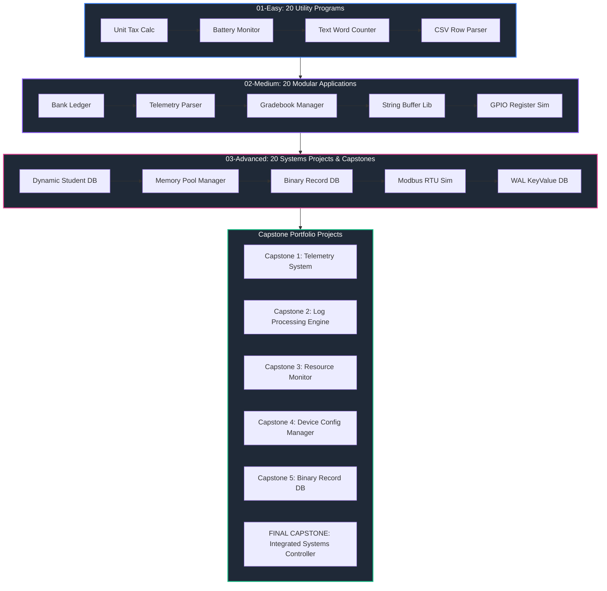

# 🛠️ Chapter 12: Real-World Practical Projects

<p align="center">
  <strong>A comprehensive, 60-project capstone curriculum designed to transform procedural C language knowledge into practical software engineering, systems architecture, embedded drivers, and technical interview mastery.</strong>
</p>

---

## 🎯 Purpose & Overview

Chapter 12 represents the practical integration milestone of the **C Programming Mastery** curriculum. Rather than serving as another collection of isolated syntax drills, Chapter 12 challenges the learner to synthesize concepts mastered across **Chapters 01 through 11**—from basic arithmetic and control flow to pointers, struct data models, file stream persistence, and dynamic heap memory management.

Every single project in this chapter is built with explicit architectural intent:
- **Software Integration**: Combining arrays, pointers, structs, file I/O, and dynamic memory into cohesive applications.
- **Defensive Engineering**: Enforcing input sanitization, error codes, boundary checks, and clean dynamic memory deallocation (`free()`).
- **Modular C Architecture**: Organizing code into production-grade multi-file structure (`src/`, `.h` headers, `.c` implementations, `tests/`).
- **Industry & Interview Readiness**: Developing real-world software across CLI utilities, telemetry loggers, binary databases, parsers, and embedded register drivers.

---

## 🎓 Prerequisites

Before attempting the projects in Chapter 12, learners should have completed:
- **Tiers 1 & 2 (Chapters 01–08)**: Core syntax, operators, loops, functions, pointer arithmetic, 2D arrays, and string buffer manipulation.
- **Tier 3 (Chapters 09–11)**: User-defined `struct`/`union` types, file stream I/O (`FILE*`, `fread`, `fwrite`), and dynamic heap memory allocation (`malloc`, `calloc`, `realloc`, `free`).

---

## 🔍 Overlap Check & Cross-Reference Inventory

To ensure every project provides genuine pedagogical value without accidental duplication, all 60 projects in Chapter 12 have been cross-checked against the **55 mini-projects** in Chapters 01–11. Where a project shares a domain theme with an earlier mini-project, it intentionally advances the architecture:

| Chapter 12 Project | Theme / Domain | Earlier Mini-Project | One-Line Justification for Distinctness |
| :--- | :--- | :--- | :--- |
| `01-Easy/01-Unit-Tax-Calculator` | Tax & Receipt | `02-Operators/projects/05` | Adds progressive multi-tier tax bracket calculations and itemized receipt formatting. |
| `01-Easy/02-Battery-Health-Monitor` | Sensor Telemetry | `01-Basics/projects/02` | Adds dynamic array sampling, voltage range validation, and state classification logic. |
| `01-Easy/06-Config-Key-Value-Extractor` | Config Parsing | `08-Strings/projects/05` | Adds key-value delimiter splitting and whitespace trimming algorithms. |
| `02-Medium/01-Bank-Transaction-Ledger` | Banking & Ledger | `03-Conditionals/projects/01` | Adds multi-file C architecture, transaction struct arrays, and binary file persistence. |
| `02-Medium/02-Telemetry-Packet-Parser` | Telemetry Parsing | `01-Easy/11` | Adds multi-field frame header parsing, struct packing alignment, and corrupt packet rejection. |
| `02-Medium/05-Student-Gradebook-Manager` | Gradebook | `09-Structures/projects/01` | Adds weighted GPA algorithms, class rank sorting, and binary `gradebook.dat` serialization. |
| `02-Medium/06-Warehouse-Inventory-Tracker` | Inventory System | `09-Structures/projects/02` | Adds fast SKU searching, low-stock threshold alert reports, and CSV persistence. |
| `02-Medium/07-Sensor-Logger-Simulator` | Telemetry Logging | `01-Easy/09` | Adds circular ring buffer data structures, moving average windows, and log appending. |
| `02-Medium/10-Custom-String-Buffer-Library` | String Utility | `08-Strings/projects/05` | Adds dynamic `realloc` buffer expansion, encapsulated API functions, and memory safety. |
| `02-Medium/12-Simple-Virtual-RAM-Allocator` | Memory Manager | `11-Dynamic-Memory/projects/05` | Adds fixed-block memory headers, First-Fit allocation search, and offset tracking. |
| `02-Medium/15-Simple-KeyValue-Store` | Database Engine | `01-Easy/06` | Adds in-memory lookup table indexing, deletion tombstone compaction, and database file dumping. |
| `02-Medium/20-Microcontroller-GPIO-Simulator` | Embedded Drivers | `02-Operators/projects/01` | Adds C `union` bitfield register mapping, 32-bit hex dumps, and pin mode configuration. |
| `03-Advanced/01-Dynamic-Student-Info-System` | Student Database | `02-Medium/05` | Adds dynamic `realloc` array capacity scaling, binary serialization, and CSV exporting. |
| `03-Advanced/05-Custom-Memory-Pool-Manager` | Memory Allocator | `02-Medium/12` | Adds production fixed-block bitmask tracking, `void*` alignment, and `pool_destroy` cleanup. |
| `03-Advanced/06-Structured-Binary-Record-DB` | Binary Database | `10-File-IO/projects/01` | Adds random binary file access (`fseek`/`ftell`), in-place record updates, and defragmentation. |
| `03-Advanced/10-Modbus-RTU-Packet-Simulator` | Serial Protocols | `02-Medium/02` | Adds Modbus CRC-16 polynomial math, function code handling, and exception frames. |
| `03-Advanced/11-Simple-KeyValue-DB-with-WAL` | Database Durability | `02-Medium/15` | Adds Write-Ahead Logging (WAL), crash recovery replay, and log compaction. |
| `03-Advanced/15-CAPSTONE-1-Telemetry-System` | Enterprise Systems | `03-Advanced/02` | Multi-module capstone adding multi-device tracking, binary streams, fault-tolerant logs, and HTML reports. |
| `03-Advanced/16-CAPSTONE-2-Log-Processing-Engine` | Stream Processing | `03-Advanced/04` | Enterprise capstone adding function pointer execution pipelines, live pattern alerts, and JSON/HTML reports. |
| `03-Advanced/19-CAPSTONE-5-Record-Database` | File Database Engine | `03-Advanced/06` | Multi-table capstone adding in-memory index tables, transaction logging, and defragmentation. |
| `03-Advanced/20-FINAL-CAPSTONE-Systems-Controller` | Flagship Synthesis | All Chapters 01–11 | Flagship final capstone integrating dynamic memory, multi-file C architecture, binary storage, and FSM. |

---

## 🗺️ Project Roadmap & Learning Progression

The projects in Chapter 12 follow a strict pedagogical progression designed to transition learners from writing small single-file scripts to designing complex multi-module systems:

```text
LEARN CONCEPT ──► SMALL APPLICATION ──► MULTI-CONCEPT INTEGRATION ──► DATA PERSISTENCE ──► DYNAMIC MEMORY ──► MODULAR ARCHITECTURE ──► CAPSTONE PROJECTS ──► FLAGSHIP SYSTEM
```



---

## 📁 Complete Project Directory Index

Below is the complete catalog of all 60 projects in Chapter 12:

### 🟢 01-Easy Projects (1–20)

| ID | Project Title | Main Concepts | Estimated Time | Builds On |
| :---: | :--- | :--- | :---: | :--- |
| `01` | **Unit Tax Calculator** | Variables, Progressive Conditionals, Formatted I/O | 1 hr | `02-Operators/projects/05` |
| `02` | **Battery Health Monitor** | 1D Arrays, Voltage Averages, Status Mapping | 1.5 hrs | `01-Basics/projects/02` |
| `03` | **Daily Water Tracker** | Loops, Array Accumulation, Progress % | 1 hr | `01-Basics/projects/03` |
| `04` | **Simple Text Word Counter** | Strings, `<ctype.h>`, State-Machine Scanning | 1.5 hrs | `08-Strings/projects/01` |
| `05` | **Resistor Color Decoder** | Strings, `strcmp`, Lookups, Resistance Math | 1.5 hrs | `02-Operators/projects/01` |
| `06` | **Config Key-Value Extractor** | Strings, Pointers, `strchr`, Delimiter Parsing | 1.5 hrs | `08-Strings/projects/05` |
| `07` | **Single File Line Counter** | File I/O (`fopen`, `fgetc`), Line/Byte Counting | 1.5 hrs | `10-File-IO/projects/02` |
| `08` | **Time Format Converter** | `sscanf`, `sprintf`, 12h/24h Time Conversion | 1.5 hrs | `03-Conditionals/projects/05` |
| `09` | **Sensor Range Validator** | Arrays, Range Filtering, Output Pointers | 1.5 hrs | `07-Arrays/projects/01` |
| `10` | **Simple CLI Menu Shell** | Do-While, Switch-Case, Input Buffer Flushing | 1 hr | `03-Conditionals/projects/01` |
| `11` | **Checksum-8 Calculator** | Byte Arrays, Bitwise XOR (`^`), Sum % 256 | 1.5 hrs | `02-Operators/projects/04` |
| `12` | **Basic CSV Row Parser** | Strings, Pointers, Delimiter Scanning | 1.5 hrs | `08-Strings/projects/04` |
| `13` | **Simple Task Timer Logger** | File Appending (`'a'`), Formatted `fprintf` | 1 hr | `10-File-IO/projects/03` |
| `14` | **Matrix Diagonal Inspector** | 2D Arrays, Nested Loops, Diagonal Coordinates | 1.5 hrs | `07-Arrays/projects/02` |
| `15` | **Character Frequency Histogram** | Arrays, Character Indexing (`ch - 'a'`), Text Bars | 1.5 hrs | `08-Strings/projects/01` |
| `16` | **Fixed Buffer Circular Shift** | Arrays, Modulo Arithmetic, Element Rotation | 1.5 hrs | `07-Arrays/projects/04` |
| `17` | **Device Uptime Formatter** | Structs, Modulo Time Division, Output Formatting | 1.5 hrs | `09-Structures/projects/03` |
| `18` | **Simple File Hex Viewer** | File I/O (`fread`), Hex Formatting (`%02X`) | 2 hrs | `10-File-IO/projects/02` |
| `19` | **Safe Integer Input Validator** | Functions, `fgets` + `sscanf`, Range Bounds | 1.5 hrs | `05-Functions/projects/01` |
| `20` | **Dynamic Array MinMax Finder** | Dynamic Memory (`malloc`, `free`), Pointers | 1.5 hrs | `11-Dynamic-Memory/projects/01` |

---

### 🟡 02-Medium Projects (1–20)

| ID | Project Title | Main Concepts | Estimated Time | Builds On |
| :---: | :--- | :--- | :---: | :--- |
| `01` | **Bank Transaction Ledger** | Struct Arrays, Multi-file C, File Persistence | 3.5 hrs | `03-Conditionals/projects/01` |
| `02` | **Telemetry Packet Parser** | Binary Frame Headers, Bitwise XOR, Struct Alignment | 4.5 hrs | `01-Easy/11` |
| `03` | **INI Config Manager** | File Parsing, Section Lookup, Key-Value Tables | 4 hrs | `01-Easy/06` |
| `04` | **Log File Severity Filter** | CLI Arguments (`argc`/`argv`), Stream Filtering | 3.5 hrs | `10-File-IO/projects/04` |
| `05` | **Student Gradebook Manager** | Struct Arrays, Sorting (Selection/Bubble), Binary I/O | 4.5 hrs | `09-Structures/projects/01` |
| `06` | **Warehouse Inventory Tracker** | SKU Searching, Reorder Threshold Alerts, CSV I/O | 4.5 hrs | `09-Structures/projects/02` |
| `07` | **Sensor Data Logger Simulator** | Circular Ring Buffers, Moving Averages, Append Logs | 4.5 hrs | `01-Easy/09` |
| `08` | **CSV Data Filter CLI** | File Stream Filtering, CLI Arguments, Dynamic Parsing | 4.5 hrs | `01-Easy/12` |
| `09` | **Digital Clock State Machine** | Finite State Machine (`enum`), Event Handlers, Structs | 4 hrs | `03-Conditionals/projects/03` |
| `10` | **Custom String Buffer Library** | Dynamic Memory (`realloc`), Dynamic Capacity | 4.5 hrs | `08-Strings/projects/05` |
| `11` | **Flight Reservation System** | 2D Struct Arrays, Seat Maps, Binary Persistence | 4.5 hrs | `07-Arrays/projects/03` |
| `12` | **Virtual RAM Allocator** | Pointer Arithmetic, Block Headers, First-Fit Alloc | 5 hrs | `11-Dynamic-Memory/projects/05` |
| `13` | **CLI Todo Manager** | Subcommand Parsing, Struct Arrays, File Storage | 4 hrs | `10-File-IO/projects/03` |
| `14` | **Markdown Link Extractor** | Text Stream State Machine, URL Scheme Validation | 4.5 hrs | `08-Strings/projects/01` |
| `15` | **Simple KeyValue Store** | In-Memory Lookup Table, Tombstone Compaction | 5 hrs | `01-Easy/06` |
| `16` | **System Event Log Analyzer** | Log Aggregation, Hourly Buckets, Statistical Reports | 4.5 hrs | `10-File-IO/projects/05` |
| `17` | **Password Vault Manager** | Bitwise XOR Encryption, Struct Arrays, File Security | 4.5 hrs | `08-Strings/projects/03` |
| `18` | **Matrix Math Library CLI** | 2D Array Algorithms, Matrix Multiplication, File I/O | 4.5 hrs | `07-Arrays/projects/02` |
| `19` | **Automated Quiz Evaluation Engine** | Question File Parsing, Interactive Quiz, Scoring | 4 hrs | `03-Conditionals/projects/02` |
| `20` | **Microcontroller GPIO Register Sim** | Unions, Bitfields, Bitwise Register Masks | 4.5 hrs | `02-Operators/projects/01` |

---

### 🔴 03-Advanced Projects & Capstones (1–20)

| ID | Project Title | Main Concepts | Estimated Time | Builds On |
| :---: | :--- | :--- | :---: | :--- |
| `01` | **Dynamic Student Info System** | Dynamic Array (`realloc`), Binary I/O, CSV Export | 7 hrs | `02-Medium/05` |
| `02` | **Embedded Telemetry Processor** | Dynamic Ring Buffers, 3-Sigma Anomaly Detection | 7 hrs | `02-Medium/07` |
| `03` | **Expression Tokenizer & Evaluator** | Lexical Tokenizer, Dynamic Stacks, Shunting-Yard | 7.5 hrs | `05-Functions/projects/01` |
| `04` | **Log Analyzer & Report Generator** | High-Throughput Stream Parsing, HTML Reports | 7 hrs | `02-Medium/04` |
| `05` | **Custom Memory Pool Manager** | Fixed-Block Pool Allocator, Bitmask Array, `void*` | 7.5 hrs | `02-Medium/12` |
| `06` | **Structured Binary Record Database** | Random Binary Access (`fseek`), Compaction | 7 hrs | `10-File-IO/projects/01` |
| `07` | **CPU Task Scheduler Simulator** | TCB Queues, Function Pointers, FCFS / Round-Robin | 7 hrs | `05-Functions/projects/04` |
| `08` | **Configurable Input Validator** | Function Pointer Callbacks, Rule Table Engine | 7 hrs | `01-Easy/19` |
| `09` | **Virtual File System Explorer** | Hierarchical Tree Nodes, Dynamic Memory, Pathing | 7.5 hrs | `09-Structures/projects/01` |
| `10` | **Modbus RTU Packet Simulator** | CRC-16 Polynomial Math, Industrial FCs, Exception Frames | 7.5 hrs | `02-Medium/02` |
| `11` | **Simple KeyValue DB with WAL** | Write-Ahead Logging (WAL), Crash Recovery, Snapshots | 7.5 hrs | `02-Medium/15` |
| `12` | **CSV to JSON Transpiler CLI** | Data Type Inference, JSON Syntax Escaping | 6 hrs | `02-Medium/08` |
| `13` | **Electronic Component Inventory** | Domain Struct Models, HTML Catalog Generator | 7 hrs | `02-Medium/06` |
| `14` | **Custom Lexical Analyzer Scanner** | Lexical Tokenizer, Keyword Lookup, Line/Col Tracking | 7 hrs | `01-Easy/04` |
| `15` | 🏆 **CAPSTONE 1: Telemetry System** | Multi-Module C, Dynamic Allocation, Binary Logs | 11 hrs | `03-Advanced/02` |
| `16` | 🏆 **CAPSTONE 2: Log Processing Engine** | Function Pointer Pipeline, Pattern Alerts, Reports | 11 hrs | `03-Advanced/04` |
| `17` | 🏆 **CAPSTONE 3: Resource Monitor** | System Telemetry, Dynamic Buffers, CLI Dashboard | 11 hrs | `03-Advanced/07` |
| `18` | 🏆 **CAPSTONE 4: Device Config Manager** | Config Parsing, Bitfield Register Mapping, EEPROM CRC | 11 hrs | `03-Advanced/10` |
| `19` | 🏆 **CAPSTONE 5: Record Database Engine** | Multi-Table Binary Storage, Index Tables, Compaction | 11 hrs | `03-Advanced/06` |
| `20` | 👑 **FINAL CAPSTONE: Systems Controller** | Synthesis of Chapters 01–11: Dynamic RAM, FSM, Storage | 18 hrs | Chapters 01–11 Synthesis |

---

## 📌 Convention Note for Starter Files

To maintain **100% consistency** across the `C Programming Mastery` repository, all starter code files in Chapter 12 follow the repository's established placeholder convention:

1. **Unsolved `main.c` Files**:
   ```c
   #include <stdio.h>

   int main() {
       // TODO: Solve this problem yourself.
       return 0;
   }
   ```
2. **Multi-File Header (`.h`) and Implementation (`.c`) Stubs**:
   - Headers and module source files start with `// TODO: Implement this file.` at the top.
   - Include guards and clean function stubs are provided with a one-line comment explaining the stub's target responsibility—but **zero implementation logic** is provided.

This ensures learners write code independently while benefiting from standardized multi-file architecture blueprints.

---

## ⚙️ Recommended Engineering Workflow

When working on Chapter 12 projects, follow the modern software engineering lifecycle:

1. **Requirements & Architecture Analysis**: Read the project `README.md` completely. Understand inputs, outputs, data models, and edge cases before opening a code editor.
2. **Modular Design**: For Medium and Advanced projects, map functions into header prototypes (`.h`) and implementation files (`.c`).
3. **Incremental Coding**: Implement core functions first (e.g. data initialization, basic I/O) before adding complex sorting or file persistence algorithms.
4. **Compilation & Warning Flags**: Compile your programs using standard strict C compiler flags:
   ```bash
   gcc -Wall -Wextra -std=c11 src/main.c src/module.c -o program
   ```
5. **Rigorous Testing**: Execute all checks in the project's **Testing Checklist**. Verify boundary values, missing files, invalid inputs, and memory allocation failure paths.
6. **Memory Safety**: For dynamic memory projects, verify zero memory leaks using Valgrind or compiler sanitizers:
   ```bash
   valgrind --leak-check=full ./program
   ```

---

## 📊 Final Chapter 12 Summary Statistics

- **Total Easy Projects**: `20`
- **Total Medium Projects**: `20`
- **Total Advanced Projects**: `14`
- **Total Specialized Capstone Projects**: `5`
- **Flagship Final Capstone Project**: `1`
- **Grand Total Chapter 12 Projects**: `60`
- **Curriculum Status**: 🟢 Fully Designed, Cataloged, & Synchronized with Repository Root.
