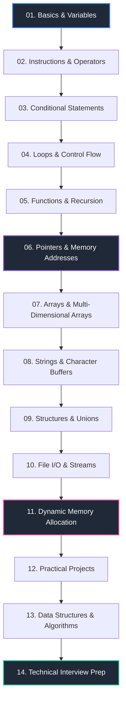

# ⚡ C Programming Mastery

<p align="center">
  
</p>

<p align="center">
  <strong>A comprehensive, topic-wise C Programming repository featuring structured theory, visual cheat sheets, practice problems, real-world projects, data structures & algorithms, and technical interview preparation.</strong>
</p>

<p align="center">
  <a href="#-learning-roadmap"></a>
  <a href="LICENSE"></a>
  <a href="#-repository-progress"></a>
  <a href="#-contributing"></a>
  <a href="#-about-this-repository"></a>
</p>

---

## 🎯 Purpose & Vision

The **C-Programming-Mastery** repository documents a complete, structured journey through the C programming language—from absolute core fundamentals to low-level dynamic memory management, practical software projects, data structures, and technical interview preparation.

Designed as both a personal portfolio showcase and an open learning resource, this repository combines **rigorous theory**, **handcrafted visual cheat sheets**, **graduated practice problems**, and **production-style clean code** to help software engineers, computer science students, and self-taught developers master procedural programming from the ground up.

---

## 📑 Table of Contents

- [🎯 Purpose \& Vision](#-purpose--vision)
- [📖 About This Repository](#-about-this-repository)
- [✨ Key Features](#-key-features)
- [🗺️ Learning Roadmap](#️-learning-roadmap)
- [📁 Repository Structure](#-repository-structure)
- [📚 Topics Covered](#-topics-covered)
- [🎨 Visual Notes \& Cheat Sheets](#-visual-notes--cheat-sheets)
- [🛠️ Projects Breakdown](#️-projects-breakdown)
- [📊 Data Structures \& Algorithms (DSA)](#-data-structures--algorithms-dsa)
- [💡 Interview Preparation](#-interview-preparation)
- [🚀 Getting Started](#-getting-started)
  - [Prerequisites](#prerequisites)
  - [Installation \& Compilation](#installation--compilation)
- [📈 Repository Progress](#-repository-progress)
- [🤝 Contributing](#-contributing)
- [📄 License](#-license)
- [🙏 Acknowledgements](#-acknowledgements)

---

## 📖 About This Repository

Learning C requires a balance between theoretical concepts, memory model visualization, and consistent code implementation. This repository is organized systematically so that learners can move from fundamental logic to advanced systems concepts seamlessly.

Every single chapter in this repository is designed with a standardized layout containing:

- **Structured Theory**: Deep dives into concepts, language specifications, and memory behaviors.
- **Visual Cheat Sheets**: High-resolution notes and diagrams illustrating pointer mechanics, stack frames, and control flows.
- **Graduated Code Problems**:
  - 🟢 **Easy**: Core syntax and basic problem-solving.
  - 🟡 **Medium**: Algorithmic thinking, control logic, and multi-step tasks.
  - 🔴 **Hard**: Advanced logic, pointer arithmetic, memory bounds, and edge cases.
- **Diagrams & Visual Assets**: Flowcharts, memory layout figures, and byte-level breakdown images.
- **Practice Questions**: Conceptual self-assessment prompts and exercises.
- **Interview-Oriented Examples**: Real-world interview problems, tricky output predictions, and common bug-fixing scenarios.

---

## ✨ Key Features

| Feature | Description | Benefit |
| :--- | :--- | :--- |
| **✔ Beginner Friendly** | Starts from zero prerequisites with crystal-clear syntax explanations. | Smooth onboarding for new programmers. |
| **✔ Topic-wise Learning** | Logically separated modular modules covering focused C concepts. | Structured step-by-step progress without overwhelm. |
| **✔ Easy → Hard Hierarchy** | Categorized code problems within every single module. | Smooth difficulty scaling for skill building. |
| **✔ Visual Cheat Sheets** | Illustrated memory diagrams, pointer flows, and syntax summaries. | Rapid visual retention and quick reference. |
| **✔ Practical Projects** | Real-world applications divided into Beginner, Intermediate, and Advanced tiers. | Hands-on portfolio project building. |
| **✔ Interview Preparation** | Output prediction, pointer puzzles, debugging exercises, and MCQs. | Target readiness for technical software interviews. |
| **✔ Clean Code** | Formatted according to modern C standards (C11/C99) with explicit variable naming. | Promotes industry-standard coding habits. |
| **✔ Well Documented** | Detailed `README.md` docs present inside every individual chapter directory. | Self-contained learning chapters. |
| **✔ GitHub Portfolio Quality** | Clean folder organization, standard licensing, and professional presentation. | Instantly impresses recruiters and engineering leads. |

---

## 🗺️ Learning Roadmap

The curriculum follows a proven pedagogical path designed to build strong mental models of computer architecture and C language mechanics.



<details>
<summary><strong>🔍 Text-Based Roadmap (Click to expand)</strong></summary>

```text
Basics & Variables
       ↓
Instructions & Operators
       ↓
Conditional Statements
       ↓
Loops & Control Flow
       ↓
Functions & Recursion
       ↓
Pointers & Memory Addresses
       ↓
Arrays (1D & 2D)
       ↓
Strings & Character Handling
       ↓
Structures & Unions
       ↓
File Handling (I/O Streams)
       ↓
Dynamic Memory Allocation (malloc, calloc, realloc, free)
       ↓
Real-World Projects (Beginner → Advanced)
       ↓
Data Structures & Algorithms (DSA in C)
       ↓
Technical Interview Preparation
```

</details>

---

## 📁 Repository Structure

```text
C-Programming-Mastery/
│
├── README.md                           # Main repository documentation & guide
├── LICENSE                             # Open-source MIT License
├── .gitignore                          # Git ignore configuration for C build artifacts
├── C-Programming-Visual-Notes.pdf      # Complete consolidated visual notes compilation
│
├── 01-Basics-and-Variables/            # Chapter 01: Core syntax, data types, I/O
├── 02-Instructions-and-Operators/      # Chapter 02: Operators, precedence, expressions
├── 03-Conditional-Statements/          # Chapter 03: Decision making (if-else, switch)
├── 04-Loops/                           # Chapter 04: Iteration constructs (while, for, do-while)
├── 05-Functions-and-Recursion/         # Chapter 05: Modularization, scope, stack recursion
├── 06-Pointers/                        # Chapter 06: Addresses, dereferencing, pointer arithmetic
├── 07-Arrays/                          # Chapter 07: 1D/2D arrays, memory layouts
├── 08-Strings/                         # Chapter 08: Character arrays, string functions
├── 09-Structures/                      # Chapter 09: User-defined types, structs, unions, typedef
├── 10-File-IO/                         # Chapter 10: Streams, file reading/writing, binary I/O
├── 11-Dynamic-Memory/                  # Chapter 11: Dynamic allocation (malloc, free, memory leaks)
├── 12-Projects/                        # Chapter 12: Real-world practical applications
├── 13-DSA-Practice/                    # Chapter 13: Data Structures & Algorithms in C
└── 14-Interview-Prep/                  # Chapter 14: Interview questions, debugging, MCQs
```

### 📂 Standard Chapter Anatomy

Every module (`01` through `14`) is organized into the following consistent internal folder structure:

```text
[Chapter-Directory]/
├── README.md          # Comprehensive module theory & cheat sheet notes
├── easy/              # Fundamental practice programs
├── medium/            # Intermediate logic & problem-solving programs
├── hard/              # Advanced programs & edge-case handling
└── images/            # High-resolution visual diagrams & cheat sheets
```

---

## 📚 Topics Covered

The following table provides an overview of the curriculum modules, current implementation status, and difficulty classification across the repository.

| Chapter | Topic | Status | Difficulty | Programs |
| :---: | :--- | :---: | :---: | :---: |
| **01** | [Basics & Variables](01-Basics-and-Variables/) | 🟢 Complete | Beginner | Coming Soon |
| **02** | [Instructions & Operators](02-Instructions-and-Operators/) | 🟢 Complete | Beginner | Coming Soon |
| **03** | [Conditional Statements](03-Conditional-Statements/) | 🟢 Complete | Beginner | Coming Soon |
| **04** | [Loops & Control Flow](04-Loops/) | 🟢 Complete | Beginner | Coming Soon |
| **05** | [Functions & Recursion](05-Functions-and-Recursion/) | 🟢 Complete | Intermediate | Coming Soon |
| **06** | [Pointers & Memory Addresses](06-Pointers/) | 🟢 Complete | Intermediate | Coming Soon |
| **07** | [Arrays (1D & 2D)](07-Arrays/) | 🟢 Complete | Beginner-Intermediate | Coming Soon |
| **08** | [Strings & Character Buffers](08-Strings/) | 🟢 Complete | Intermediate | Coming Soon |
| **09** | [Structures & Unions](09-Structures/) | 🟡 In Progress | Intermediate | Coming Soon |
| **10** | [File Handling (I/O Streams)](10-File-IO/) | 🟡 In Progress | Intermediate | Coming Soon |
| **11** | [Dynamic Memory Allocation](11-Dynamic-Memory/) | 🟡 In Progress | Advanced | Coming Soon |
| **12** | [Practical Projects](12-Projects/) | 🟡 In Progress | All Levels | Coming Soon |
| **13** | [DSA Practice in C](13-DSA-Practice/) | ⚪ Planned | Advanced | Coming Soon |
| **14** | [Technical Interview Prep](14-Interview-Prep/) | ⚪ Planned | All Levels | Coming Soon |

> **Status Legend**: 🟢 Complete & Verified | 🟡 Actively Under Development | ⚪ Planned / Upcoming

---

## 🎨 Visual Notes & Cheat Sheets

Visual learning significantly enhances comprehension of computer hardware interactions, pointer references, and memory allocation.

- 🖼️ **Module Cheat Sheets**: Each individual chapter includes custom graphic cheat sheets inside its `images/` subfolder illustrating core principles (such as Stack vs Heap layout, pointer dereferencing, and array indexing).
- 📄 **Consolidated Visual PDF**: A complete, high-resolution master compilation of visual notes is available in the root folder as [`C-Programming-Visual-Notes.pdf`](C-Programming-Visual-Notes.pdf) (or [`C programming Visual Notes_watermark.pdf`](C%20programming%20Visual%20Notes_watermark.pdf)).

---

## 🛠️ Projects Breakdown

The `12-Projects/` directory hosts hands-on C applications structured into three distinct difficulty levels to build software architecture skills:

### 🟢 Beginner Projects
- **Console Calculator**: Arithmetic expression evaluation, input parsing, error handling.
- **Number Guessing Game**: Random number generation, control loops, score tracking.
- **Student Grade System**: Struct-based record management with basic console rendering.

### 🟡 Intermediate Projects
- **Bank Management System**: Account operations, structured record persistence, file storage.
- **Library Management System**: Search algorithms, book borrowing/return tracking, record updates.
- **Tic-Tac-Toe Game**: Multi-dimensional array manipulation, two-player game loop, win-condition logic.

### 🔴 Advanced Projects
- **File Encryption/Decryption Tool**: Low-level byte manipulation, XOR/AES cipher algorithms, binary file I/O.
- **Custom Shell / CLI Parser**: Tokenization, string parsing, process execution fundamentals.
- **Memory Allocator Simulator**: Custom implementation of heap block tracking (`malloc` / `free` mechanics).

---

## 📊 Data Structures & Algorithms (DSA)

Mastering C provides an unmatched foundation for Data Structures and Algorithms. The `13-DSA-Practice/` module provides low-level, clean-pointer implementations of core computer science structures:

```text
13-DSA-Practice/
├── Linear-Data-Structures/
│   ├── Arrays/            # Static arrays, dynamic arrays, sliding window
│   ├── Linked-Lists/      # Singly, doubly, and circular linked lists
│   ├── Stacks/            # Array-based & pointer-based LIFO stacks
│   └── Queues/            # Simple queues, circular queues, priority queues
│
├── Non-Linear-Data-Structures/
│   ├── Trees/             # Binary trees, Binary Search Trees (BST), AVL trees
│   └── Graphs/            # Adjacency matrices, adjacency lists, BFS/DFS traversal
│
└── Algorithms/
    ├── Searching/         # Linear search, binary search
    ├── Sorting/           # Bubble, Selection, Insertion, Merge, Quick, Heap sort
    └── Recursion/         # Backtracking, dynamic programming basics in C
```

---

## 💡 Interview Preparation

The `14-Interview-Prep/` module is specifically engineered to prepare developers for technical rounds at top tech companies and systems engineering roles:

- **Output-Based Questions**: Tricky snippet evaluation involving pointer arithmetic, pre/post increment subtleties, operator precedence, and unspecified behavior.
- **Debugging & Memory Leak Challenges**: Codebases containing deliberate bugs, dangling pointers, memory leaks, and buffer overflows designed for analysis and correction.
- **Multiple Choice Questions (MCQs)**: Conceptual questions testing C standards, compiler phases, memory alignment, and storage classes (`auto`, `extern`, `static`, `register`).
- **Coding Interview Problems**: Standard algorithmic challenges implemented under strict time and memory constraints.

---

## 🚀 Getting Started

Follow these steps to set up the repository locally and run C programs on your system.

### Prerequisites

Ensure you have a C compiler installed on your system:

- **GCC / Clang** (Linux / macOS)
- **MinGW-w64 / GCC** (Windows)
- **Visual Studio / MSVC** (Windows optional alternative)

Verify installation in your terminal:
```bash
gcc --version
```

### Installation & Compilation

1. **Clone the Repository**:
   ```bash
   git clone https://github.com/YourUsername/C-Programming-Mastery.git
   cd C-Programming-Mastery
   ```

2. **Navigate to a Module & Compile a Program**:
   ```bash
   # Navigate to desired topic directory
   cd 01-Basics-and-Variables/easy/

   # Compile using GCC
   gcc main.c -o program -Wall -Wextra -std=c11

   # Execute on Linux / macOS
   ./program

   # Execute on Windows Command Prompt / PowerShell
   .\program.exe
   ```

---

## 📈 Repository Progress

Track the ongoing development progress across all chapters:

- [x] **01. Basics & Variables**
- [x] **02. Instructions & Operators**
- [x] **03. Conditional Statements**
- [x] **04. Loops & Control Flow**
- [x] **05. Functions & Recursion**
- [x] **06. Pointers & Memory**
- [x] **07. Arrays (1D & 2D)**
- [x] **08. Strings & Character Buffers**
- [ ] **09. Structures & Unions**
- [ ] **10. File Handling (I/O Streams)**
- [ ] **11. Dynamic Memory Allocation**
- [ ] **12. Practical Projects**
- [ ] **13. Data Structures & Algorithms**
- [ ] **14. Technical Interview Prep**

---

## 🤝 Contributing

Contributions, issues, and feature requests are welcome! Whether you are fixing a typo in theory documentation, adding a practice problem, or implementing an algorithm:

1. **Fork** the project repository.
2. Create your Feature Branch (`git checkout -b feature/AmazingFeature`).
3. Commit your changes (`git commit -m 'Add some AmazingFeature'`).
4. Push to the Branch (`git push origin feature/AmazingFeature`).
5. Open a **Pull Request**.

Please ensure your code adheres to standard C formatting guidelines and includes clear comments.

---

## 📄 License

Distributed under the **MIT License**. See [`LICENSE`](LICENSE) for more details.

---

## 🙏 Acknowledgements

- **Self-Directed Learning Journey**: The visual cheat sheets, diagrams, and structured notes within this repository were created as part of my personal journey to master procedural software development and low-level computer science.
- **Open Source Community**: Shared openly to empower students, self-taught coders, and developers worldwide who are mastering C.
- **Tools & Utilities**: Diagrams created using Mermaid.js and custom drawing tools.

<p align="center">
  <sub>Maintained with ❤️ by an aspiring Systems Engineer. Built for developers everywhere.</sub>
</p>
  
