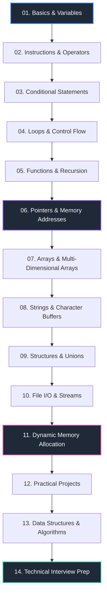

# ⚡ C Programming Mastery

<p align="center">
  
</p>

<p align="center">
  <strong>A comprehensive, topic-wise C Programming repository featuring structured theory, visual cheat sheets, practice problems, real-world projects, data structures & algorithms, and technical interview preparation.</strong>
</p>

<p align="center">
  <a href="#-learning-roadmap"></a>
  <a href="LICENSE"></a>
  <a href="ROADMAP.md"></a>
  <a href="CONTRIBUTING.md"></a>
  <a href="#-about-this-repository"></a>
</p>

---

## 🎯 Purpose & Vision

The **C-Programming-Mastery** repository documents a complete, structured journey through the C programming language—from absolute core fundamentals to low-level dynamic memory management, practical software projects, data structures, and technical interview preparation.

Designed as both a personal portfolio showcase and an open learning resource, this repository combines **rigorous theory**, **handcrafted visual cheat sheets**, **graduated practice problems**, and **production-style clean code** to help software engineers, computer science students, and self-taught developers master procedural programming from the ground up.

---

## 📑 Table of Contents

- [🎯 Purpose \& Vision](#-purpose--vision)
- [📖 About This Repository](#-about-this-repository)
- [🎓 Learning Path Guide](#-learning-path-guide)
- [✨ Key Features](#-key-features)
- [🗺️ Learning Roadmap](#️-learning-roadmap)
- [📁 Repository Structure](#-repository-structure)
- [📚 Topics Covered](#-topics-covered)
- [🎨 Visual Notes \& Cheat Sheets](#-visual-notes--cheat-sheets)
- [🛠️ Projects Breakdown](#️-projects-breakdown)
- [📊 Data Structures \& Algorithms (DSA)](#-data-structures--algorithms-dsa)
- [💡 Interview Preparation](#-interview-preparation)
- [🚀 Getting Started](#-getting-started)
- [📈 Repository Progress](#-repository-progress)
- [🏛️ Repository Governance \& Citation](#️-repository-governance--citation)
- [🤝 Contributing](#-contributing)
- [📄 Dual License Strategy](#-dual-license-strategy)
- [🙏 Acknowledgements](#-acknowledgements)

---

## 📖 About This Repository

Learning C requires a balance between theoretical concepts, memory model visualization, and consistent code implementation. This repository is organized systematically so that learners can move from fundamental logic to advanced systems concepts seamlessly.

Every single chapter in this repository is designed with a standardized layout containing:

- **Structured Theory**: Deep dives into concepts, language specifications, and memory behaviors.
- **Visual Cheat Sheets**: High-resolution notes and diagrams illustrating pointer mechanics, stack frames, and control flows.
- **Graduated Code Problems**:
  - 🟢 **Easy**: Core syntax and basic problem-solving (`easy/`).
  - 🟡 **Medium**: Algorithmic thinking, control logic, and multi-step tasks (`medium/`).
  - 🔴 **Hard**: Advanced logic, pointer arithmetic, memory bounds, and edge cases (`hard/`).
- **Diagrams & Visual Assets**: Flowcharts, memory layout figures, and byte-level breakdown images.
- **Practice Questions & Interview Prep**: Output predictions, debugging exercises, MCQs, and interview theory (`interview/`).
- **Real-World Mini Projects**: Self-contained applications for portfolio building (`projects/`).

---

## 🎓 Learning Path Guide

For a complete step-by-step student study guide, recommended VS Code setup, compiler installation instructions, and chapter progression advice, see [`LEARNING_PATH.md`](LEARNING_PATH.md).

---

## ✨ Key Features

| Feature | Description | Benefit |
| :--- | :--- | :--- |
| **✔ Beginner Friendly** | Starts from zero prerequisites with crystal-clear syntax explanations. | Smooth onboarding for new programmers. |
| **✔ Topic-wise Learning** | Logically separated modular modules covering focused C concepts. | Structured step-by-step progress without overwhelm. |
| **✔ Easy → Hard Hierarchy** | Categorized code problems within every single module. | Smooth difficulty scaling for skill building. |
| **✔ Visual Cheat Sheets** | Illustrated memory diagrams, pointer flows, and syntax summaries. | Rapid visual retention and quick reference. |
| **✔ Practical Projects** | Real-world applications divided into Beginner, Intermediate, and Advanced tiers. | Hands-on portfolio project building. |
| **✔ Interview Preparation** | Output prediction, pointer puzzles, debugging exercises, and MCQs. | Target readiness for technical software interviews. |
| **✔ Clean Code** | Formatted according to modern C standards (C11/C99) with explicit variable naming. | Promotes industry-standard coding habits. |
| **✔ Well Documented** | Detailed `README.md` docs present inside every individual chapter directory. | Self-contained learning chapters. |
| **✔ GitHub Portfolio Quality** | Clean folder organization, dual licensing, and professional presentation. | Instantly impresses recruiters and engineering leads. |

---

## 🗺️ Learning Roadmap

The curriculum follows a proven pedagogical path designed to build strong mental models of computer architecture and C language mechanics. Detailed milestone tracking is available in [`ROADMAP.md`](ROADMAP.md).



<details>
<summary><strong>🔍 Text-Based Roadmap (Click to expand)</strong></summary>

```text
Basics & Variables
       ↓
Instructions & Operators
       ↓
Conditional Statements
       ↓
Loops & Control Flow
       ↓
Functions & Recursion
       ↓
Pointers & Memory Addresses
       ↓
Arrays (1D & 2D)
       ↓
Strings & Character Handling
       ↓
Structures & Unions
       ↓
File Handling (I/O Streams)
       ↓
Dynamic Memory Allocation (malloc, calloc, realloc, free)
       ↓
Real-World Projects (Beginner → Advanced)
       ↓
Data Structures & Algorithms (DSA in C)
       ↓
Technical Interview Preparation
```

</details>

---

## 📁 Repository Structure

```text
C-Programming-Mastery/
│
├── README.md                           # Main repository documentation & guide
├── LICENSE                             # Dual License (MIT for Code, CC BY-NC-ND 4.0 for Assets)
├── NOTICE                              # Authorship, Attribution & Legal Terms
├── .gitignore                          # Git ignore configuration for C build artifacts
├── CODE_OF_CONDUCT.md                  # Community behavior standards
├── CONTRIBUTING.md                     # Pull request & issue guidelines
├── SECURITY.md                         # Security policy & safe C practices
├── CHANGELOG.md                        # Version history & release notes
├── CITATION.cff                        # Citation File Format for researchers/educators
├── ROADMAP.md                          # Milestones & project roadmap
├── LEARNING_PATH.md                    # Student study guide & curriculum sequence
├── ACKNOWLEDGEMENTS.md                 # Credits & community acknowledgements
├── C-Programming-Visual-Notes.pdf      # Complete consolidated visual notes compilation
│
├── 01-Basics-and-Variables/            # Chapter 01: Core syntax, data types, I/O
├── 02-Instructions-and-Operators/      # Chapter 02: Operators, precedence, expressions
├── 03-Conditional-Statements/          # Chapter 03: Decision making (if-else, switch)
├── 04-Loops/                           # Chapter 04: Iteration constructs (while, for, do-while)
├── 05-Functions-and-Recursion/         # Chapter 05: Modularization, scope, stack recursion
├── 06-Pointers/                        # Chapter 06: Addresses, dereferencing, pointer arithmetic
├── 07-Arrays/                          # Chapter 07: 1D/2D arrays, memory layouts
├── 08-Strings/                         # Chapter 08: Character arrays, string functions
├── 09-Structures/                      # Chapter 09: User-defined types, structs, unions, typedef
├── 10-File-IO/                         # Chapter 10: Streams, file reading/writing, binary I/O
├── 11-Dynamic-Memory/                  # Chapter 11: Dynamic allocation (malloc, free, memory leaks)
├── 12-Projects/                        # Chapter 12: Real-world practical applications
├── 13-DSA-Practice/                    # Chapter 13: Data Structures & Algorithms in C
└── 14-Interview-Prep/                  # Chapter 14: Interview questions, debugging, MCQs
```

---

## 📚 Topics Covered

| Chapter | Topic | Status | Difficulty | Practice & Projects |
| :---: | :--- | :---: | :---: | :---: |
| **01** | [Basics & Variables](01-Basics-and-Variables/) | 🟢 Complete | Beginner | [View Chapter 01](./01-Basics-and-Variables/) |
| **02** | [Instructions & Operators](02-Instructions-and-Operators/) | 🟢 Complete | Beginner | [View Chapter 02](./02-Instructions-and-Operators/) |
| **03** | [Conditional Statements](03-Conditional-Statements/) | 🟢 Complete | Beginner | [View Chapter 03](./03-Conditional-Statements/) |
| **04** | [Loops & Control Flow](04-Loops/) | 🟢 Complete | Beginner | [View Chapter 04](./04-Loops/) |
| **05** | [Functions & Recursion](05-Functions-and-Recursion/) | 🟢 Complete | Intermediate | [View Chapter 05](./05-Functions-and-Recursion/) |
| **06** | [Pointers & Memory Addresses](06-Pointers/) | 🟢 Complete | Intermediate | [View Chapter 06](./06-Pointers/) |
| **07** | [Arrays (1D & 2D)](07-Arrays/) | 🟢 Complete | Beginner-Intermediate | [View Chapter 07](./07-Arrays/) |
| **08** | [Strings & Character Buffers](08-Strings/) | 🟢 Complete | Intermediate | [View Chapter 08](./08-Strings/) |
| **09** | [Structures & Unions](09-Structures/) | 🟢 Complete | Intermediate | [View Chapter 09](./09-Structures/) |
| **10** | [File Handling (I/O Streams)](10-File-IO/) | 🟢 Complete | Intermediate | [View Chapter 10](./10-File-IO/) |
| **11** | [Dynamic Memory Allocation](11-Dynamic-Memory/) | 🟢 Complete | Advanced | [View Chapter 11](./11-Dynamic-Memory/) |
| **12** | [Practical Projects](12-Projects/) | 🟢 Complete | All Levels | [View Chapter 12](./12-Projects/) |
| **13** | [DSA Practice in C](13-DSA-Practice/) | ⚪ Planned | Advanced | Planned |
| **14** | [Technical Interview Prep](14-Interview-Prep/) | ⚪ Planned | All Levels | Planned |

> **Status Legend**: 🟢 Complete & Verified | 🟡 Actively Under Development | ⚪ Planned / Upcoming

---

## 🎨 Visual Notes & Cheat Sheets

Visual learning significantly enhances comprehension of computer hardware interactions, pointer references, and memory allocation.

- 🖼️ **Module Cheat Sheets**: Each individual chapter includes custom graphic cheat sheets inside its `images/` subfolder.
- 📄 **Consolidated Visual PDF**: A master compilation of visual notes is available in the root folder as [`C programming Visual Notes_watermark.pdf`](C%20programming%20Visual%20Notes_watermark.pdf).

---

## 🛠️ Projects Breakdown

The `12-Projects/` directory and chapter `projects/` subfolders host hands-on C applications structured into three distinct difficulty levels:

- 🟢 **Beginner Projects**: Console calculator, student record system, data generators.
- 🟡 **Intermediate Projects**: Bank management system, library system, games.
- 🔴 **Advanced Projects**: File encryption tool, CLI parser, custom memory allocator simulator.

---

## 📊 Data Structures & Algorithms (DSA)

The `13-DSA-Practice/` module provides low-level, clean-pointer implementations of core computer science structures:
- **Linear**: Arrays, Singly/Doubly Linked Lists, Stacks, Queues.
- **Non-Linear**: Binary Search Trees (BST), AVL Trees, Graphs (BFS/DFS).
- **Algorithms**: Searching, Sorting (Bubble, Quick, Merge, Heap), Backtracking.

---

## 💡 Interview Preparation

The `14-Interview-Prep/` module and individual chapter `interview/` subfolders are engineered for tech interview readiness:
- **Output-Based Snippets**: Pre/post increment, pointer arithmetic, operator precedence.
- **Debugging Challenges**: Dangling pointers, memory leaks, buffer overflows.
- **MCQs & Technical Theory**: C standards, compiler phases, memory alignment.

---

## 🚀 Getting Started

### Prerequisites
Ensure you have a C compiler installed (`GCC`, `Clang`, or `MinGW-w64`).
```bash
gcc --version
```

### Installation & Compilation
```bash
# Clone the Repository
git clone https://github.com/Immanueal1/C-programming-Mastery.git
cd C-programming-Mastery

# Navigate to Chapter 01 Easy practice folder
cd 01-Basics-and-Variables/easy/

# Compile a program
gcc 01_sensor_boot_sequence.c -o program -Wall -Wextra -std=c11

# Run the executable
./program          # Linux/macOS
.\program.exe      # Windows
```

---

## 📈 Repository Progress

Track ongoing curriculum progress:
- [x] **01. Basics & Variables**
- [x] **02. Instructions & Operators**
- [x] **03. Conditional Statements**
- [x] **04. Loops & Control Flow**
- [x] **05. Functions & Recursion**
- [x] **06. Pointers & Memory**
- [x] **07. Arrays (1D & 2D)**
- [x] **08. Strings & Character Buffers**
- [x] **09. Structures & Unions**
- [x] **10. File Handling (I/O Streams)**
- [x] **11. Dynamic Memory Allocation**
- [x] **12. Practical Projects**
- [ ] **13. Data Structures & Algorithms**
- [ ] **14. Technical Interview Prep**

---

## 🏛️ Repository Governance & Citation

For repository standards, compliance, and academic citations:
- 📜 **[Code of Conduct](CODE_OF_CONDUCT.md)**: Community standards and pledge.
- 🤝 **[Contributing Guidelines](CONTRIBUTING.md)**: Pull request & issue workflow.
- 🔒 **[Security Policy](SECURITY.md)**: Safe C coding guidelines & vulnerability reporting.
- 📜 **[Changelog](CHANGELOG.md)**: Release version tracking (`v1.0.0`).
- 📌 **[Notice & Copyright](NOTICE)**: Authorship, terms of use & attribution.
- 🎓 **[Citation Metadata](CITATION.cff)**: `CITATION.cff` for scholarly/educational reference.

---

## 🤝 Contributing

Contributions via Issues or Pull Requests that fix bugs, correct documentation typos, or refine practice questions are welcome! Please read [`CONTRIBUTING.md`](CONTRIBUTING.md) before submitting code.

---

## 📄 Dual License Strategy

This repository is dual-licensed to protect original educational artwork while sharing open-source code:
- **C Source Code (`*.c`, `*.h`)**: Licensed under the **[MIT License](LICENSE)**.
- **Educational Notes, Visual Cheat Sheets, Diagrams & PDFs**: Licensed under **[CC BY-NC-ND 4.0](LICENSE)** (Attribution-NonCommercial-NoDerivatives).

> 🚫 **Attribution & Plagiarism Protection**: You are free to view, learn, and study these materials. You may NOT re-brand, copy, modify, or redistribute the educational cheat sheets, notes, or diagrams as your own work. See [`NOTICE`](NOTICE) for details.

---

## 🙏 Acknowledgements

Read our full acknowledgements in [`ACKNOWLEDGEMENTS.md`](ACKNOWLEDGEMENTS.md).

<p align="center">
  <sub>Maintained with ❤️ by <strong>Immanueal</strong>. Built for developers everywhere.</sub>
</p>
