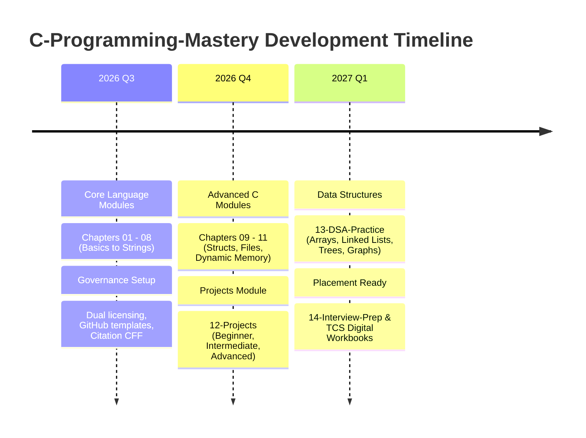

# 🗺️ Repository Development Roadmap

> Project vision and release milestones for **C-Programming-Mastery**.

---

## 📌 Development Milestones

---

## 🚦 Phase Breakdown

### Phase 1: Core C Fundamentals (🟢 Completed)
- [x] Chapter 01: Basics & Variables (Theory, Easy/Med/Hard practice, Interview questions, Projects)
- [x] Chapter 02: Instructions & Operators
- [x] Chapter 03: Conditional Statements
- [x] Chapter 04: Loops & Control Flow
- [x] Chapter 05: Functions & Recursion
- [x] Chapter 06: Pointers & Memory Addresses
- [x] Chapter 07: Arrays (1D & 2D)
- [x] Chapter 08: Strings & Character Handling
- [x] Repository Infrastructure & Governance Documentation

### Phase 2: Advanced C Systems (🟢 Completed)
- [x] Chapter 09: Structures, Unions & Typedefs
- [x] Chapter 10: File I/O & Streams
- [x] Chapter 11: Dynamic Memory Allocation (`malloc`, `calloc`, `realloc`, `free`)
- [x] Chapter 12: Real-World Practical Projects (60 Projects: 20 Easy, 20 Medium, 20 Advanced including Capstones)

### Phase 3: Data Structures & Placement Prep (⚪ Planned)
- [ ] Chapter 13: Data Structures & Algorithms in C (Linked Lists, Stacks, Queues, Trees, Graphs, Sorting)
- [ ] Chapter 14: Technical Interview Preparation (TCS Digital, Output Snippets, Debugging Challenges)
- [ ] Interactive Automated Test Suite for Practice Exercises
